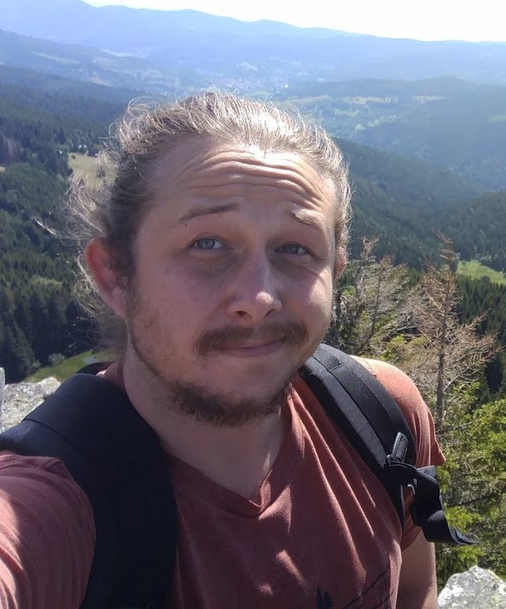

# About 1
Currently I am PhD student in the lab of [LSV](https://www.lsv.fr) in ENS Paris Saclay, under the supervision of [Finkel Alain](http://www.lsv.fr/~finkel) and [Haddad Serge](http://www.lsv.fr/~haddad). My thesis is on Machine learning and verification of infinite-state systems

# Stuff 
[xsasd asd asd](Teaching)
<a href="#opening">Take me to the opening paragraph.</a>

# Talks

# Publications

# Teaching 

 

- ####  2019-2020:
  * [Architecture and Systems](http://www.lsv.fr/~finkel)
  * [Discrete mathematics](http://www.lsv.fr/~haddad)
- ####  2019-2020:

<!--   -->
