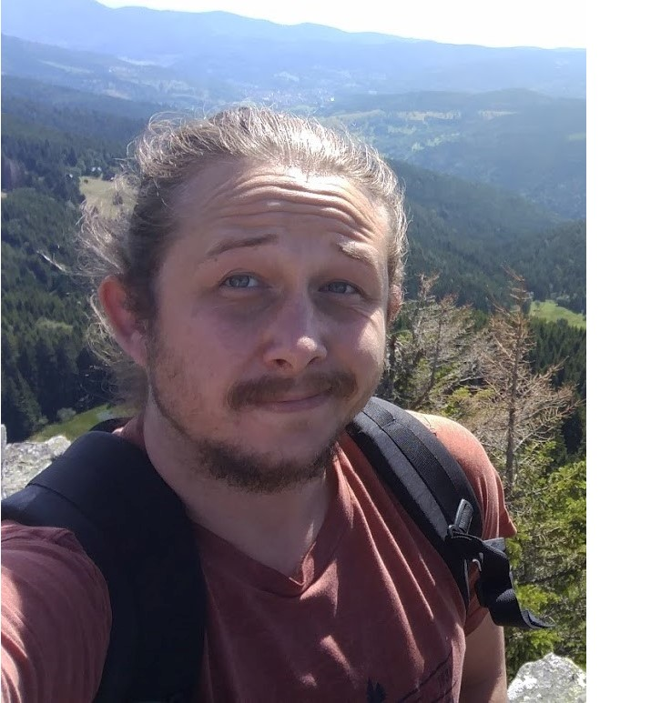

#  About
Currently I am PhD student in the lab of [LSV](https://www.lsv.fr) in ENS Paris Saclay, under the supervision of [Finkel Alain](http://www.lsv.fr/~finkel) and [Haddad Serge](http://www.lsv.fr/~haddad). My thesis is on Machine learning and verification of infinite-state systems.      

# Research
## Talks

1. "A Tool for the Coverability Problems in Petri Nets" - Tool demonstration in MSR'19, Angers France.    
2. "Coverability and Termination in Recursive Petri Nets" - Petri nets 2019.  

## Publications
### Conference:
+ 2020
   +  A. Finkel, S. Haddad, and I. Khmelnitsky. Minimal coverability tree construction made complete and efficient, FoSSaCS'20
   

+ 2019
   +  A. Finkel, S. Haddad, and I. Khmelnitsky. Coverability and Termination in Recursive Petri Nets, Petri Nets'19
   
   
   + Alain Finkel, Serge Haddad et Igor Khmelnitsky. Réification des accélérations pour la construction de Karp et Miller,MSR'19, Angers
   (in French)

# Teaching

 

-  2019-2020:
  * [Architecture and Systems](http://www.lsv.fr/~finkel)
  * [Discrete mathematics](http://www.lsv.fr/~haddad)

- 2018-2019:
  * [Combinatorial algorithms - in Hebrew](http:/www.lsv.fr~finkel)

# Stuff
  [xsasd asd asd](Teaching)
  <a href="#opening">Take me to the opening paragraph.</a>

<!--   -->
